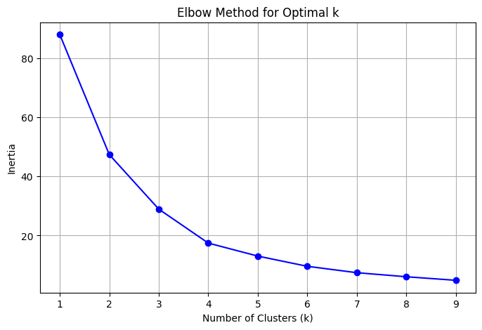
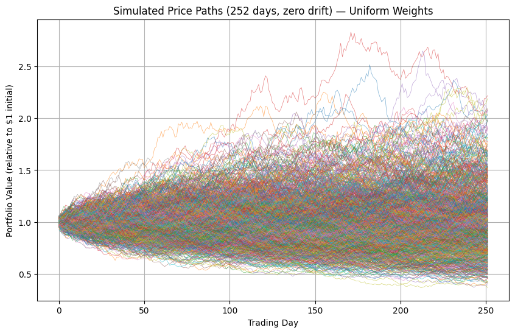
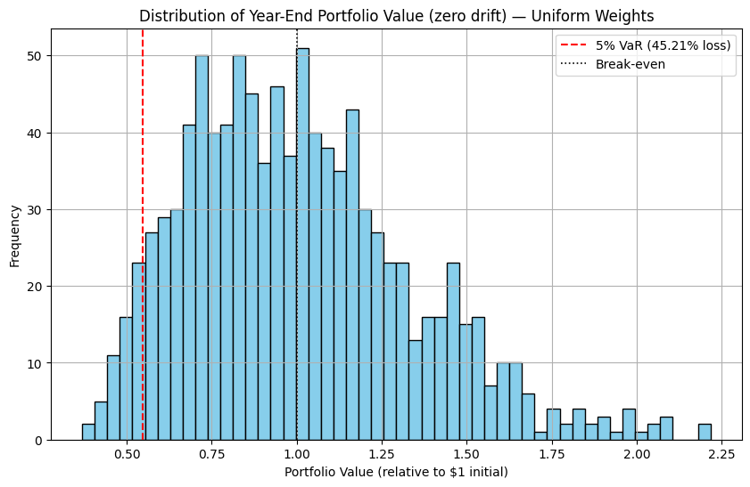
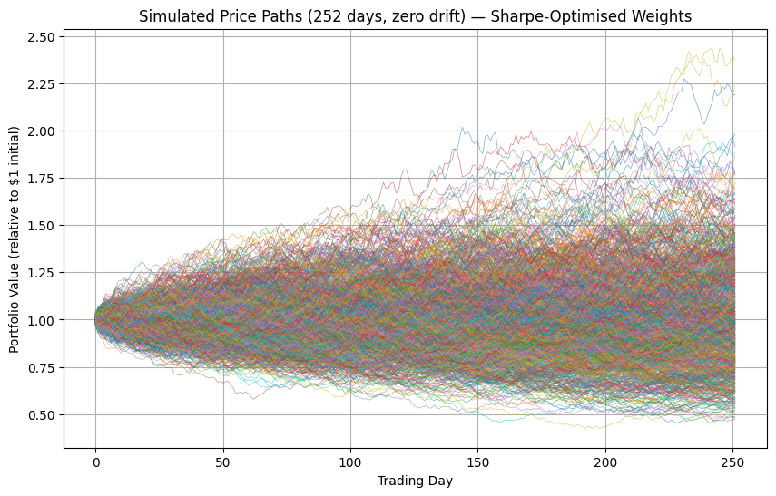
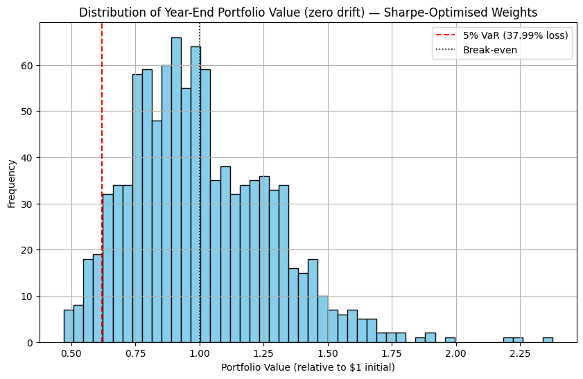
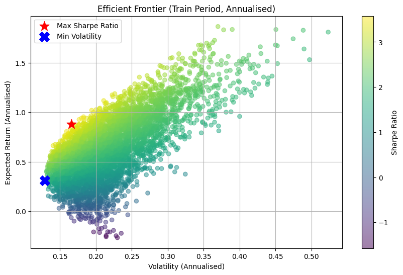
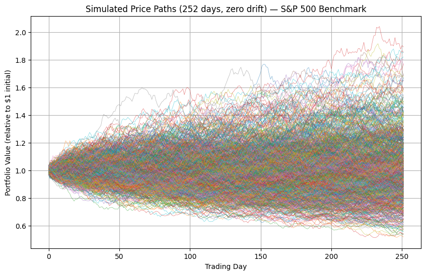
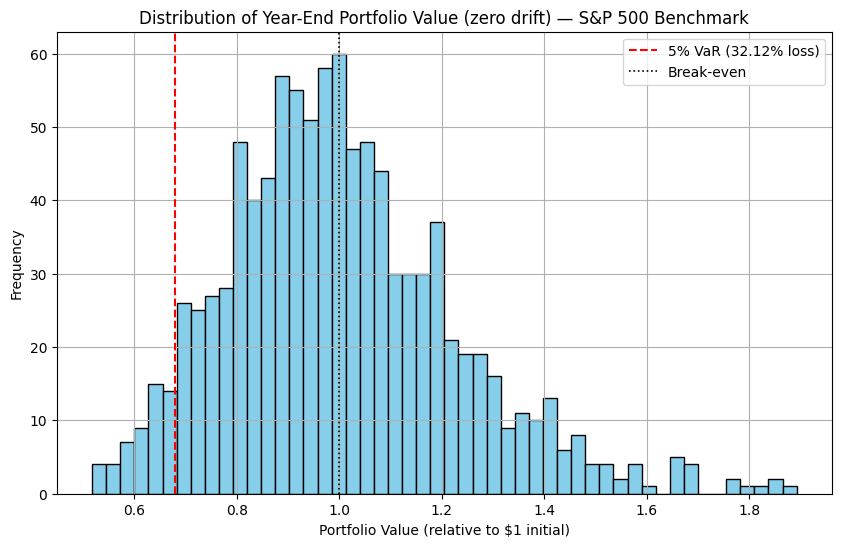
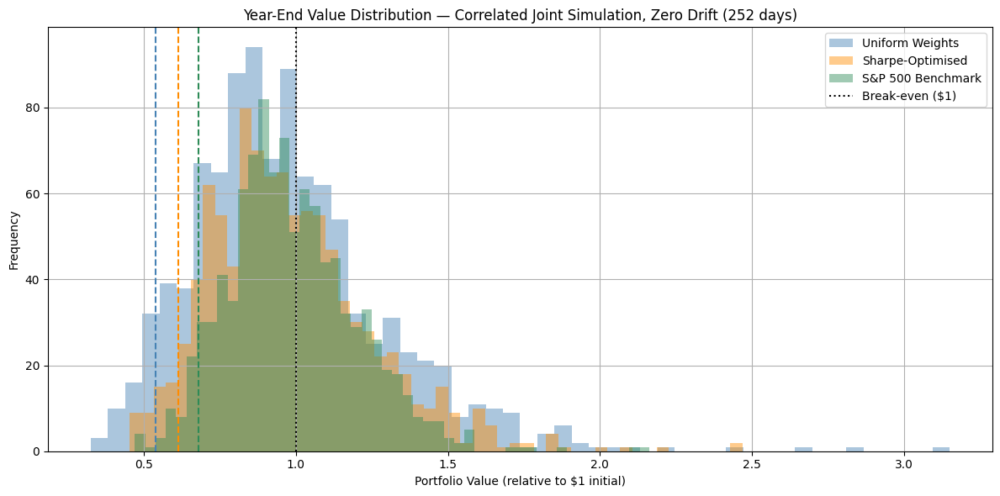
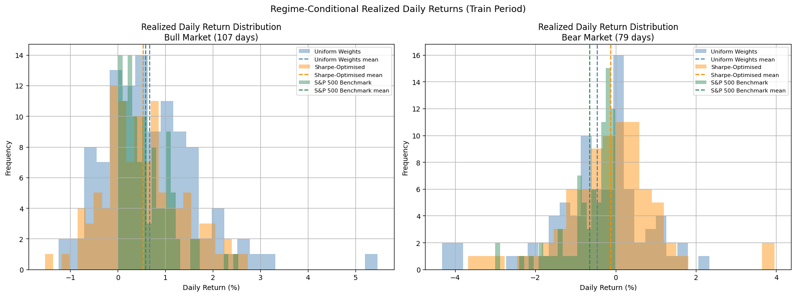

# Stock Portfolio Analysis

Mathematical methods are used to build a diverse stock portfolio from S&P 500 stocks. Monte Carlo simulations are then used to estimate the distribution of future returns and risk metrics. An efficient frontier is used to find weightings that meet desired performance criteria. A correlated joint simulation tests whether the optimised portfolio is safer than the S&P 500 over a one-year horizon.

## Key Findings

Three principal findings emerge from this analysis, each discussed in detail in the sections below.

**1. Sharpe ratio optimisation reduces risk within a concentrated stock portfolio.** The weight-constrained Sharpe optimisation produces a portfolio with lower annualised volatility (27% compared to 33%), a smaller annual Value at Risk at the 95% confidence level (38% compared to 45%), and a reduced mean maximum drawdown (-27% compared to -33%) relative to a uniform weighting of the same stocks. This indicates that the choice of weighting strategy has a meaningful and quantifiable effect on downside risk, even when the underlying stock selection is held constant.

**2. The optimised portfolio exhibits substantially lower losses on bear market days.** When the train period is partitioned into bull and bear days using the S&P 500 daily return as a regime signal, the Sharpe-optimised strategy loses an average of 0.12% per day on bear days compared to 0.46% for the uniform weighting and 0.64% for the S&P 500 benchmark. It also remains in positive territory on 48% of bear market days, compared to 38% for uniform weights. As this finding is based on realised daily returns rather than simulated projections, it is the most methodologically robust result in the analysis and is not subject to the drift estimation issues that affect the Monte Carlo simulations.

**3. A well-diversified index outperforms a concentrated stock portfolio on measures of pure downside risk.** Under a zero-drift Monte Carlo simulation, the S&P 500 exhibits lower volatility, Value at Risk, CVaR and maximum drawdown than either portfolio strategy. This is consistent with the expected implications of diversification theory: a 500-stock index eliminates substantially more idiosyncratic risk than a 7-stock portfolio can achieve through weighting alone. Outperforming the index on a risk-adjusted basis therefore requires genuine alpha in stock selection, and this framework provides a principled methodology for testing that hypothesis across different asset universes and time periods.

## Setup

```bash
pip install -r requirements.txt
jupyter notebook Portfolio_Analysis.ipynb
```

The notebook requires internet access to scrape the S&P 500 ticker list from Wikipedia and to download price history via `yfinance`. All randomness is controlled by a single `SEED` constant via the `set_seed()` helper, so re-running the notebook reproduces the same results.

## Stock Selection for Portfolio

**Stratified sector sampling.** We sample `N_PER_SECTOR = 2` tickers from each of the 11 GICS sectors, guaranteeing the initial pool of 22 stocks spans the full market before clustering. A pure random sample can accidentally over-represent one sector and leave others unrepresented.

K-means clustering then groups stocks by risk-return profile (mean return, volatility, max drawdown, Sharpe ratio computed on the train period). The elbow method is used to identify the optimal number of clusters.

The one-year price history is split into a **train period** (first 75% of trading days) and a held-out **test period** (last 25%). All stock selection and weight optimisation uses the train period only; the test period supplies the covariance matrices for the Monte Carlo simulations, ensuring that the data used to select stocks is not reused to forecast their future returns.



```
Stratified sample: 22 tickers across 11 GICS sectors
Train period: 2024-04-09 to 2025-01-02 (186 days)
Test period:  2025-01-03 to 2025-04-04 (63 days)
Optimal number of clusters: 4

Selected Securities from Clusters:
['EQT', 'TXN', 'UAL', 'HOOD', 'DVN', 'WELL', 'PM']
```

## Monte Carlo Simulations

Price paths are simulated over **252 trading days (one full year)** under a multivariate normal model, which is the standard risk-management horizon and makes the resulting VaR, CVaR and probability-of-loss figures directly interpretable as annual risk metrics.

**Why zero drift?** Setting drift to zero instead of using the short test-period mean is the standard approach in risk management. The test period (63 days, Q1 2025) coincided with a broad market sell-off. The S&P 500 mean daily return over those 63 days was approximately -0.22%; compounding this over 252 days gives a projected annual loss of -43%, which is worse than the 2008 financial crisis and clearly unrealistic as a forward forecast. Using a short and unrepresentative window to project a full year amplifies estimation noise into large artefacts. Zero drift removes this sensitivity: the simulation captures how much uncertainty there is given current volatility levels, rather than projecting the direction in which the market happened to trend in a recent quarter. The covariance matrix is still estimated from the test period so the correlation structure between assets remains out-of-sample.





```
Risk Metrics - Uniform Weights (252-day zero-drift simulation)
Mean Return:          0.66%      (slight positive due to lognormal skew, not a return forecast)
Std Dev of Return:   32.98%
Value at Risk (5%):  45.21%
Conditional VaR (5%): 50.76%
Mean Max Drawdown:   -32.57%
Probability of Loss:  53.00%
```

Optimising weights for Sharpe ratio on the train period (maximum 35% per position):

```
Optimised Weights (Max Sharpe, max weight = 35%):
EQT: 3.65%  UAL: 17.84%  WELL: 35.00%
TXN: 0.00%  HOOD: 8.51%  PM:   35.00%
DVN: 0.00%
```





```
Risk Metrics - Sharpe-Optimised Weights (252-day zero-drift simulation)
Mean Return:          0.37%
Std Dev of Return:   27.22%
Value at Risk (5%):  37.99%
Conditional VaR (5%): 43.51%
Mean Max Drawdown:   -27.31%
Probability of Loss:  55.50%
```

The optimised weighting reduces volatility and max drawdown relative to uniform weights (27% compared to 33% standard deviation, MDD -27% compared to -33%), consistent with finding 1 above.

## Efficient Frontier

We may also use an efficient frontier to find weightings that meet other performance criteria, such as minimising risk or obtaining expected returns above a specified threshold with minimal risk. The efficient frontier visualises risk-return trade-offs across 5000 randomly sampled portfolios drawn from a Dirichlet distribution, computed on the train period consistent with the weight optimisation above.



## Comparisons

We run a Monte Carlo simulation for the S&P 500 using zero drift and the test-period variance, so the comparison with the portfolio strategies is on equal terms.





```
Risk Metrics - S&P 500 Benchmark (252-day zero-drift simulation)
Mean Return:          0.31%
Std Dev of Return:   22.46%
Value at Risk (5%):  32.12%
Conditional VaR (5%): 37.81%
Mean Max Drawdown:   -23.09%
Probability of Loss:  54.50%
```

A VaR of 32% for the S&P 500 is within the historical range (approximately 15-30% in normal years, reaching 37% in 2008); the higher end here reflects the elevated volatility of the Q1 2025 test period. The notebook produces a side-by-side comparison table for all three strategies.

## Safety Test: Is the Optimised Portfolio Safer than the S&P 500?

The three simulations above use independent random draws. The safety test runs a **correlated joint simulation**: portfolio stocks and the S&P 500 are sampled from a single joint multivariate normal distribution with zero drift, driven by the same random numbers, so every scenario represents a coherent market realisation that affects all three strategies simultaneously.



```
Probability of beating S&P 500 at year-end (same scenario, zero drift):
  Sharpe-Optimised: 45.4%
  Uniform Weights:  38.9%

Safety Metrics (zero-drift correlated simulation):
                  Std Dev  Prob. of Loss  VaR (5%)  CVaR (5%)  Mean Max Drawdown
Uniform Weights    32.57%         60.50%    46.08%     53.00%            -33.64%
Sharpe-Optimised   27.10%         59.00%    38.56%     45.28%            -28.22%
S&P 500 Benchmark  21.37%         56.30%    32.15%     38.39%            -23.66%
```

These results are consistent with finding 3 above. With zero drift, the S&P 500 is the safest strategy by every metric, as its diversification across 500 stocks eliminates substantially more idiosyncratic risk than a 7-stock portfolio can remove through weighting alone. The Sharpe-optimised portfolio improves on uniform weights across all downside metrics but cannot match the index's risk profile without a compensating return premium. The Sharpe-optimised strategy beats the S&P 500 in 45% of year-end scenarios, which is below 50% and reflects that higher per-stock volatility tends to be a disadvantage in the absence of alpha.

## Regime Analysis

The train period is partitioned into bull-market days (S&P 500 daily return greater than zero) and bear-market days (S&P 500 daily return less than or equal to zero), and realised daily returns for each strategy are compared directly. This approach is used in preference to running separate Monte Carlo simulations per regime, as conditioning on a bull or bear day inflates the daily mean return (from approximately 0.07% to 0.59% on bull days) and compounding this inflated mean over 100 or more simulated days produces artefactually large cumulative returns.

```
  Bull days (S&P 500 > 0):  107
  Bear days (S&P 500 <= 0): 79
```



```
                              Mean/day  Std Dev  Ann. Sharpe  % Days +  Worst Day
Regime       Strategy
Bull Market  Uniform Weights  +0.6718%   1.0054%       10.61     75.7%   -1.2506%
             Sharpe-Optimised +0.5376%   0.8216%       10.39     74.8%   -1.5303%
             S&P 500 Benchmark+0.5885%   0.4879%       19.15    100.0%   +0.0022%
Bear Market  Uniform Weights  -0.4606%   1.2567%       -5.82     38.0%   -4.3257%
             Sharpe-Optimised -0.1196%   1.1854%       -1.60     48.1%   -3.6769%
             S&P 500 Benchmark-0.6365%   0.6556%      -15.41      0.0%   -2.9969%
```

On bear days the Sharpe-optimised strategy loses an average of 0.12% per day compared to 0.46% for uniform weights and 0.64% for the S&P 500 benchmark, and it remains in positive territory on 48% of bear market days. These results correspond to finding 2 above and constitute the most reliable evidence in the analysis, as they are derived from realised returns rather than distributional assumptions.

## Discussion

This project demonstrates models for evaluating portfolio performance whilst optimising investment strategy and mitigating risk. The following features have been implemented:

- **Stratified sector sampling**: the initial stock pool is drawn by sampling `N_PER_SECTOR` tickers per GICS sector, guaranteeing cross-sector representation before clustering.
- **Out-of-sample evaluation**: stock selection and weight optimisation use a train period; Monte Carlo simulations use a separate held-out test period to avoid using the same data both to select stocks and to project their future returns.
- **Weight concentration control**: the Sharpe ratio optimisation caps any single position at `MAX_WEIGHT` (35% by default), preventing unconstrained mean-variance optimisation from concentrating heavily into one or two names.
- **Zero-drift Monte Carlo**: drift is set to zero so that the covariance structure drives the simulation rather than a short-window trend estimate, producing annual risk metrics that are consistent with historical experience.
- **252-day simulation horizon**: one full trading year, making all risk metrics directly interpretable as annual figures.
- **Correlated joint safety test**: portfolio stocks and the S&P 500 share the same random draws so that the probability of outperformance is a meaningful comparison rather than an artefact of independent noise.
- **Regime analysis on realised returns**: bull and bear days are identified from the S&P 500 train-period returns and realised daily returns are compared directly, avoiding the compounding artefact that affects regime-conditional Monte Carlo simulations.
- **Robust data handling**: tickers with insufficient price history are dropped before clustering, and Wikipedia dot-style share class tickers are converted to the hyphen format required by `yfinance`.
- **Covariance regularisation**: a small multiple of the identity matrix (epsilon = 1e-8) is added to every covariance matrix before simulation, guaranteeing positive definiteness and enabling the faster Cholesky decomposition path throughout.
- **Resilient cluster count selection**: if `KneeLocator` finds no clear elbow, the notebook falls back to the point of maximum second derivative in the inertia curve, giving a data-driven answer rather than an arbitrary default.
- **Offline ticker fallback**: if the Wikipedia request fails or the page layout changes, the notebook falls back to a hardcoded sector-balanced list of 33 well-known S&P 500 constituents (3 per GICS sector) so the analysis can still run without internet access.

Further extensions that would improve the reliability of the results include:

- Modifying the simulated return distribution to be log-normal, or checking the normality assumption with a QQ-plot to identify where it breaks down.
- Implementing rolling-window walk-forward backtests in place of a single fixed train/test split, to assess whether the regime analysis findings are consistent across different time periods.
- Extending the asset universe to include bonds and commodities, following a similar risk-return weighting process.
- Using the Sortino ratio or CVaR optimisation to penalise downside risk more specifically than mean-variance optimisation does.
- Incorporating a long-run expected return estimate (for example from the CAPM) as the drift in a separate return-forecast scenario, alongside the zero-drift risk scenario.

## Limitations

- Daily returns are modelled as multivariate normal. Equity returns exhibit fat tails and negative skewness not captured by the Gaussian assumption, so the true probability of extreme losses is likely higher than the VaR and CVaR figures suggest.
- Performance metrics are estimated from a single one-year historical window. Results may differ substantially across different market regimes; rolling walk-forward validation would provide a more robust assessment of whether the regime-analysis findings are consistent over time.
- The 7-stock portfolio is too concentrated to eliminate idiosyncratic risk, even with optimal weighting. The comparison against the S&P 500 therefore conflates the effect of stock selection with the effect of diversification, and it is not possible to determine from this analysis alone which factor drives the risk differential.
